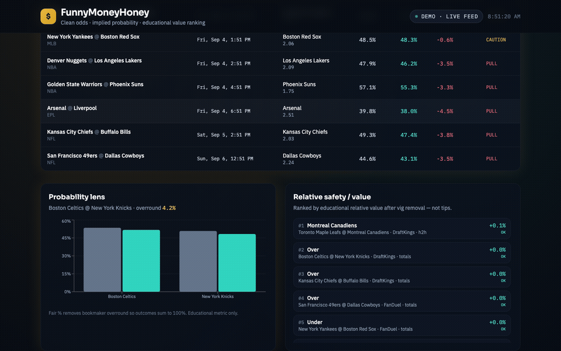

# FunnyMoneyHoney

**Clean, real-time sports odds dashboard** with implied-probability analysis, educational value ranking, pull/caution alerts, and a daily bankroll simulator — powered only by public odds APIs (or bundled demo data).

Self-hosted alternative to commercial odds screens. No sportsbook login. No scraping. No bet placement. Strictly educational.

> **Repository:** [btstevens1984az/FunnyMoneyHoney](https://github.com/btstevens1984az/FunnyMoneyHoney)

---

## Risk disclaimer

**Not financial or gambling advice.** Past or simulated results do **not** predict future outcomes. Gambling involves risk of loss.

FunnyMoneyHoney does **not** claim historical profits, guaranteed win rates, or predictive AI. Educational scores are transparent odds math (implied probability, overround removal, relative value) — not tips.

---

## Screenshots / Live product demos

| View | Preview |
|------|---------|
| Odds table |  |
| Probability lens |  |
| Bankroll simulator |  |
| Dark dashboard |  |

<p align="center">
  
</p>

<p align="center">
  
</p>

<p align="center">
  
</p>

<p align="center">
  
</p>

Re-capture real UI loops (API `:8000`, UI `:5173`, Playwright + ffmpeg):

```bash
cd scripts && npm install && npx playwright install chromium
node capture-readme.mjs
```

See [docs/MEDIA.md](docs/MEDIA.md).

---

## Quick start

### Docker Compose (Linux, macOS, Windows)

```bash
git clone https://github.com/btstevens1984az/FunnyMoneyHoney.git
cd FunnyMoneyHoney
cp .env.example .env
docker compose up --build
```

| Surface | URL |
|---------|-----|
| UI | http://localhost:5173 |
| API docs | http://localhost:8000/docs |
| Health | http://localhost:8000/health |

Demo mode works **without** an API key. Odds on the board keep updating via deterministic micro-moves on bundled sample events.

### Local (no Docker)

**Linux:** [docs/INSTALL_LINUX.md](docs/INSTALL_LINUX.md) · **Windows:** [docs/INSTALL_WINDOWS.md](docs/INSTALL_WINDOWS.md)

```bash
# Backend
cd backend && python3 -m venv .venv && source .venv/bin/activate
pip install -r requirements.txt
cp ../.env.example ../.env
uvicorn app.main:app --reload --port 8000

# Frontend (other terminal)
cd frontend && npm install && npm run dev
```

Open http://localhost:5173

### Optional live odds

1. Get a key from [The Odds API](https://the-odds-api.com/) (public REST API).
2. Set in `.env`:

```env
DEMO_MODE=false
ODDS_API_KEY=your_key_here
```

---

## Features

| Feature | Purpose |
|---------|---------|
| **Today's markets** | NBA, NFL, MLB, NHL, EPL sample board (demo) or live public odds |
| **Implied probability** | `1 / decimal odds` per outcome |
| **Fair probability** | Vig/overround removed so outcomes sum to 100% |
| **Relative safety / value** | Educational ranking after overround removal |
| **Pull / caution alerts** | Warn when relative value is deeply negative or margins are wide |
| **Educational thinking** | Step-by-step transparent analysis (not a claimed win rate) |
| **$1000 bankroll sim** | Monte Carlo paths, median / 5th / 95th %ile ranges |
| **Demo real-time feed** | Works offline; prices refresh on an interval |
| **Snapshot cache** | SQLAlchemy + SQLite (PostgreSQL-ready) |
| **Docker + CI** | Compose one-command start · pytest · GitHub Actions · MIT |

---

## Project structure

```
FunnyMoneyHoney/
├── backend/           # FastAPI, odds math, simulator, pytest
├── frontend/          # React + TypeScript + Tailwind + Recharts
├── docs/              # Install, architecture, media guide
├── media/             # README stills + readme/ GIF loops
├── scripts/           # Playwright capture + placeholder GIFs
├── .github/workflows/ # CI
├── docker-compose.yml
├── .env.example
├── LICENSE            # MIT
└── README.md
```

---

## Tests & CI

```bash
cd backend && pytest -q
cd frontend && npm run build
```

GitHub Actions: `.github/workflows/ci.yml`

---

## Topics

`sports-odds` `fastapi` `react` `typescript` `tailwindcss` `docker` `the-odds-api` `educational` `self-hosted` `recharts` `monte-carlo` `mit-license`

---

## License

MIT — see [LICENSE](LICENSE).
